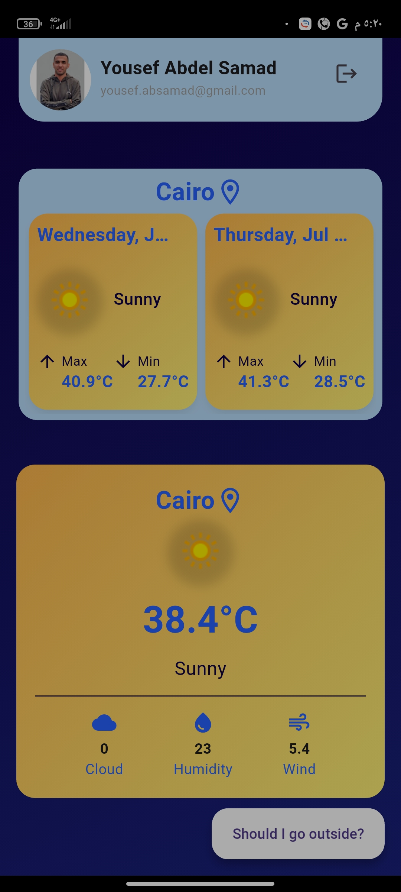
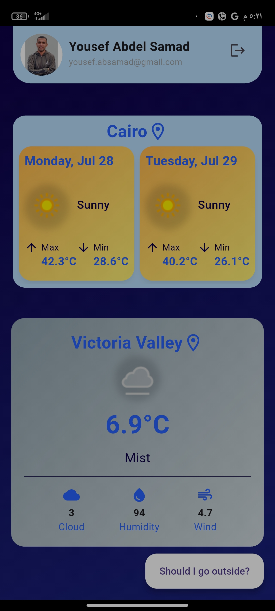
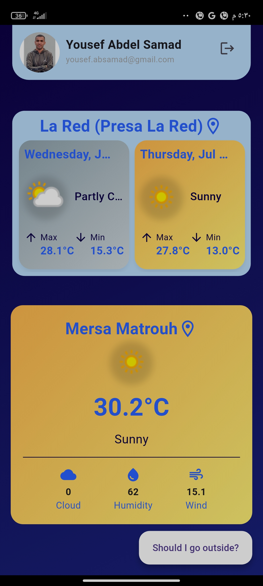
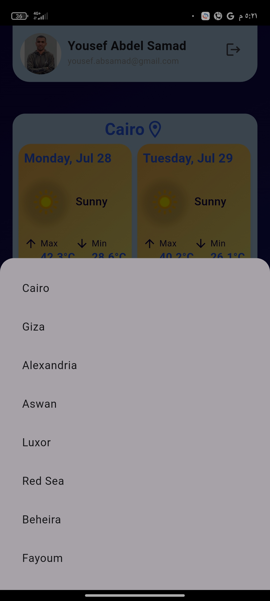
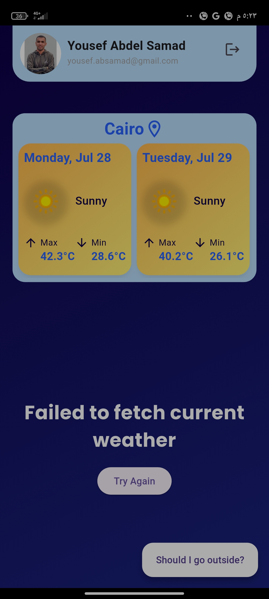
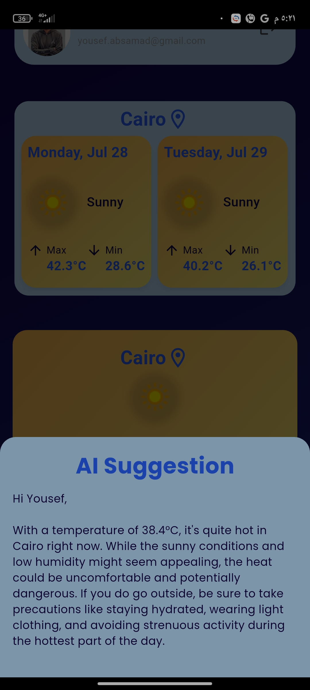

# 🌤️ Weather App

A modern weather application built with **Flutter**, following the principles of **Clean Architecture**.

---

## 🚀 Features

### 🔐 Authentication

- Sign in with **Google**
- Sign in with **Email & Password**
- **Forgot Password** support
- **Firebase** integration to store user data:
  - Name
  - Email
  - Profile Picture (if signed in with Google)

### 🌦️ Weather Data

- Fetch **current weather** based on user location
- Display **7-day weather forecast**

### 🤖 AI Suggestion (Gemini Integration)

- User can click a button to send current weather data to **Gemini AI**
- Gemini responds with a suggestion on whether the weather is suitable for going out or not

### 📲 Splash Screen

- Detects if a user is already logged in
- Navigates to:
  - **Home screen** if logged in
  - **Login screen** otherwise

---

## 🧱 Architecture

- Built with **Clean Architecture**
- Uses **Dependency Injection** (via `GetIt`)
- Separation of concerns between:
  - UI
  - Domain
  - Data layers

---

## 🛠️ Technologies Used

- Flutter
- Firebase Auth & Realtime Database
- Google Sign-In
- Gemini AI (LLM)
- Dartz (for functional programming)
- GetIt (for dependency injection)
- Clean Architecture pattern

---

## 📷 Screenshots

  
  
  

 

  
  

 

  
  
  

 

  
  
  

